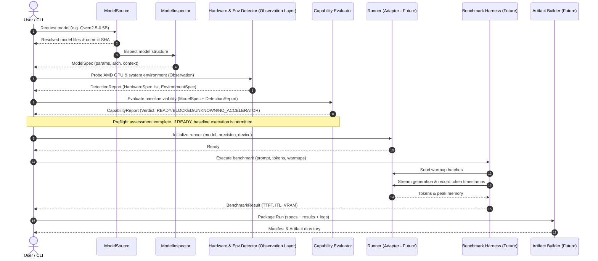

# ROCmHub Architecture Specification

> **Mission**: *"We make every open model AMD-ready automatically."*

ROCmHub is an open-source platform designed to automate the preparation, optimization, benchmarking, and verification of open AI models on AMD GPUs and the ROCm ecosystem.

---

## 1. Architectural Principles

1. **Modularity over Monolith**: Each stage of the pipeline (model acquisition, inspection, hardware detection, execution, benchmarking, and artifact generation) is encapsulated behind clear, typed interfaces.
2. **Deterministic Reproducibility**: No benchmark or run is valid without full provenance:
   - Model identifier, requested revision (branch/tag), and resolved immutable Git commit SHA.
   - Hardware spec: AMD GPU product name, compute units, VRAM, and exact `gfx` target string (e.g. `"gfx90a"`, `"gfx942"`, `"gfx1100"`, `"unknown"`).
   - Software environment: OS, Linux kernel, ROCm runtime, HIP version, driver version, PyTorch ROCm build, and active environment variables.
   - Execution config: backend runtime, precision, batch size, prompt/generation length, warmup iterations.
   - Raw logs, performance metrics (TTFT, ITL, throughput, peak VRAM), and explicit execution status.
3. **Separation of Benchmark Guard and Optimizer**: Benchmarking must remain isolated from any future optimization agent. The AI Engineer proposes candidates; a standalone, tamper-proof Benchmark Guard measures and certifies Pareto-optimal results. An agent never certifies its own output.
4. **Separation of Optimization and Validation**: Performance gains must be co-validated with output correctness (perplexity, numerical drift, or semantic evaluation). Fast but corrupted outputs are rejected.
5. **Runtime-Agnostic Core**: Core workflows do not hardcode vLLM, SGLang, or TGI. Runtimes are treated as interchangeable backend adapters implementing a unified execution contract.
6. **Hardware Heterogeneity & Open Target Discovery**: The architecture does not assume a single GPU type. It explicitly supports both datacenter (AMD Instinct / CDNA) and workstation/consumer (AMD Radeon / RDNA) architectures. Hardware detection probes real runtime capabilities dynamically; static compatibility matrices serve only as versioned advisory hints. An unknown GPU or gfx string is never rejected solely due to absence from a hardcoded list.
7. **Grounded Capabilities & Diagnostic Integrity**: If a feature depends on a specific ROCm version or gfx architecture, it is explicitly modeled as a capability constraint. Diagnostic mode on non-ROCm systems allows model inspection, environment discovery, schema validation, and pipeline verification, but NEVER generates synthetic or fake benchmark numbers. Metrics on non-inference runs are strictly marked `NOT_MEASURED` or `None`.

---

## 2. MVP Boundaries

### In Scope for MVP (Phase 1)
- **Local CLI Pipeline**: Single command to inspect, run, benchmark, and package a model.
- **Hugging Face Model Source**: Resolution of model references to an immutable commit SHA, downloading config and weights.
- **Static & Dynamic Model Inspector**: Extraction of architecture class, parameter count, context length, default precision, and tensor layout without unnecessary full-weight loads.
- **AMD/ROCm Environment Detector**:
  - Live detection via `rocm-smi`, `/sys/class/kfd`, `torch.version.hip`, and `rocminfo`.
  - Dynamic discovery of target architecture (`gfx_target` as an open string), VRAM, ROCm version, and PyTorch HIP status.
  - Safe Diagnostic / Fallback mode for development/CI on non-AMD environments without fake performance numbers.
- **Baseline Hugging Face / PyTorch Runner**: Direct execution adapter using native PyTorch on ROCm (FP16/BF16, single GPU).
- **Inference Benchmark Harness**:
  - Time To First Token (TTFT in milliseconds: `ttft_ms`).
  - Inter-Token Latency (ITL in milliseconds: `itl_ms_mean`, `itl_ms_p50`, `itl_ms_p90`, `itl_ms_p99`).
  - Generation throughput (`throughput_tokens_per_sec`).
  - Peak allocated and reserved VRAM (`peak_vram_used_mb`).
  - Storage for raw latency samples and metric summaries.
- **Reproducible Artifact Builder**: Self-contained output directory containing `manifest.json`, benchmark results, environment snapshot, and a reproduction command.

### Explicitly Out of Scope for MVP
- Cloud orchestration, multi-node clusters, and distributed job queues.
- Web UI, authentication, and user management.
- Custom inference engine development.
- Autonomous AI Engineer optimization loops.
- Kernel Arena (custom Triton/HIP kernel compilation).
- Quantization search (AWQ, GPTQ, FP8 sweeps).
- Automatic CUDA-to-HIP source translation.

---

## 3. Core Modules & Responsibilities

```
rocmhub/
├── models/        # Model fetching, caching, and structural inspection
├── hardware/      # AMD GPU discovery, gfx target detection, ROCm environment specs
├── capabilities/  # Capability matching and baseline execution evaluation
├── runners/       # Pluggable backend adapters (Baseline HF/PyTorch, future vLLM, SGLang)
├── benchmarks/    # Isolated benchmarking harness, metric collectors (TTFT, ITL, VRAM)
├── validation/    # Hard correctness checks & comparative quality retention
├── artifacts/     # Manifest generation, schema validation, artifact packaging
├── guard/         # Independent Benchmark Guard, stability checks, and reproducibility gate
├── forge/         # Model Forge: automated model preparation and build execution
├── engineer/      # Autonomous AI Engineer: observe-plan-act loop & safe tools
└── cli/           # Developer command-line interface
```

### 3.1 `rocmhub.models`
- **`ModelSource` (Protocol)**: Abstract interface decoupling the core from specific model registries:
  - `source_name: str`: Identifier (e.g. `"huggingface"`).
  - `resolve_revision(model_id, revision) -> str`: Resolves requested revision (branch/tag/SHA) into an immutable 40-character Git commit SHA.
  - `get_repository_metadata(model_id, revision) -> RepositoryMetadata`: Obtains file listings and hub-level metadata without downloading tensor binaries.
  - `fetch_metadata_file(model_id, filename, revision) -> Optional[str]`: Fetches lightweight JSON/text configs.
- **`HuggingFaceModelSource`**: Adapter using `huggingface_hub`:
  - Enforces `trust_remote_code=False` at all times (no remote code execution).
  - Translates Hub-specific exceptions on the adapter boundary into domain exceptions (`ModelNotFoundError`, `AuthRequiredError`, `RevisionNotFoundError`, `NetworkError`).
  - Utilizes standard Hugging Face local cache (`~/.cache/huggingface/hub`).
- **`ModelInspector`**: Static analysis engine constructing validated `ModelSpec`:
  - Safely extracts `architecture` without loading weights into RAM/VRAM.
  - Detects `weights_format` (`safetensors`, `pytorch_bin`, `gguf`, `unknown`).
  - Discovers `parameter_count` from server-side safetensors metadata or index metadata without guessing (`None` if indeterminable).
  - Extracts `context_length` from standard config fields (`max_position_embeddings`, `seq_length`, etc.).
  - Rejects untrusted remote code with `RemoteCodeRequiredError` if architecture resolution requires executing repository scripts.

### 3.2 `rocmhub.hardware`
- **Separation of Concerns**: Hardware detection functions strictly as an **observation layer**. It observes and reports what is physically and dynamically detected on the system (devices, compute units, memory, ROCm versions, environment flags). It does *not* apply policy, judge compatibility with models, or decide runtime feasibility. Capability evaluation and compatibility verification remain separate future domain components.
- **`HardwareDetector`**: Queries hardware capabilities dynamically via a prioritized multi-tier fallback:
  1. PyTorch HIP runtime (`torch.cuda` under ROCm)
  2. `rocminfo` (HSA agent enumeration)
  3. `amd-smi` (modern AMD System Management Interface)
  4. `rocm-smi` (legacy System Management Interface)
  5. Linux sysfs / KFD topology (`/sys/class/kfd/topology/nodes/`)
  - Discovers GPU product name (e.g., `AMD Instinct MI300X`, `AMD Radeon RX 7900 XTX`).
  - Target architecture (`gfx_target: str`, open string discovered dynamically, e.g., `gfx1100`, `gfx942`).
  - Total and available VRAM, CU count, and PCI bus ID.
  - Multi-GPU enumeration (`List[HardwareSpec]`).
  - Non-AMD hosts (macOS, Linux CPU-only, CI) execute cleanly in diagnostic mode (0 GPUs detected, exit code 0, no mock numbers).
- **`EnvironmentDetector`**: Gathers system environment state:
  - OS version, kernel release, CPU architecture.
  - ROCm version (from `/opt/rocm/.info/version`, `rocminfo`, or `rocm-smi`).
  - HIP runtime version and `torch.version.hip`.
  - Strict whitelist isolation of ROCm environment variables (`HSA_OVERRIDE_GFX_VERSION`, `ROCR_VISIBLE_DEVICES`, `HIP_VISIBLE_DEVICES`, etc.) ensuring no sensitive tokens or host secrets are captured.
- **`DetectionReport`**: Bundles `EnvironmentSpec`, `List[HardwareSpec]`, observation provenance (tracking which detection source yielded data), and non-fatal diagnostic warnings.

### 3.3 `rocmhub.capabilities`
- **Separation of Facts from Policy**: Raw observations collected by `SystemObserver` are evaluated against the versioned `CapabilityPolicy`.
- **`CapabilityEvaluator`**: Performs static preflight evaluation linking `ModelSpec` and `DetectionReport`:
  - Answers: *"Based on available facts, are there grounds to proceed to baseline execution?"*
  - **Critical Invariant**: `CapabilityReport` is a **preflight assessment**, **NOT** proof of runtime compatibility. Only an actual subsequent baseline execution run can prove that the model works on the target device.
  - Zero weight downloads: parses only lightweight configuration and metadata.
  - Zero inference executions: does not construct tensors or invoke models.
  - Non-binary verdicts: `READY`, `BLOCKED`, `UNKNOWN`, `NO_ACCELERATOR`.
  - `UNKNOWN` is **never** automatically converted to `BLOCKED`, preserving support for newly released or unlisted architectures.
  - Multi-GPU individual device evaluation: assesses each GPU device separately without merging into a virtual entity.
  - Generates structured `EvaluationReason` items with machine-readable codes, severities (`ok`, `info`, `warning`, `blocker`), and concrete factual evidence.
- **`CapabilityPolicy`**: Versioned reference defining known upstream architectures and format constraints.

### 3.4 `rocmhub.runners`
- **`BaseRunner` (Protocol)**: Defines the common baseline execution lifecycle:
  - `runner_name`: Unique string identifier (e.g. `"pytorch_transformers_hip"`).
  - `supports(model: ModelSpec, capability_report: CapabilityReport) -> bool`: Verifies preflight readiness and architectural compatibility.
  - `load(model: ModelSpec, device_id: int, precision: str) -> None`: Loads model and tokenizer into memory on concrete device.
  - `generate(prompt: str, max_new_tokens: int = 16, **kwargs: Any) -> RunResult`: Executes deterministic inference, computing exact generated text and token counts.
  - `unload() -> None`: Drops model/tokenizer references, runs garbage collection, and clears accelerator cache.
- **`HuggingFaceRunner`**: MVP baseline implementation utilizing PyTorch + Transformers on AMD ROCm/HIP:
  - Loads model using `AutoModelForCausalLM` and `AutoTokenizer` with immutable `revision=model.commit_sha` and `trust_remote_code=False`.
  - Sets precision strictly (`fp32`, `fp16`, `bf16`).
  - Dispatches to concrete target AMD device (e.g. `cuda:0` under HIP); never uses `device_map="auto"`.
  - Deterministic generation (`temperature=0.0`, `do_sample=False`).
  - Strict token accounting: `generated_tokens` counts exclusively newly decoded tokens, never input tokens.
  - Memory cleanup on `unload()`: `gc.collect()` and `torch.cuda.empty_cache()` (if CUDA/HIP available).
  - Preflight gating: if `capability_report.verdict != READY`, execution is skipped without downloading weights.

### 3.5 `rocmhub.benchmarks`
- **`BenchmarkHarness`**: Orchestrates warmup iterations, timed measurement iterations, and accelerator device synchronization (`torch.cuda.synchronize`).
- **`TokenTimestampStreamer`**: Streaming emission callback that captures high-resolution monotonic timestamps (`time.perf_counter_ns`) upon the arrival of each newly decoded token.
- **`MemoryTracker`**: Monitors PyTorch allocator-observed peak memory using `torch.cuda.max_memory_allocated(device)` and resets via `reset_peak_memory_stats(device)`. Documented as *allocator-observed memory*, not total physical VRAM.
- **`MetricsCalculator`**: Pure statistical calculation and aggregation engine:
  - **TTFT (Time To First Token)**: $\text{TTFT} = \frac{t_{\text{first\_token\_ns}} - t_{\text{request\_start\_ns}}}{1{,}000{,}000}$ ms. Strictly defined as generation start to first generated token arrival. Never approximated by total latency or average token time.
  - **ITL (Inter-Token Latency)**: $\text{ITL}_i = \frac{t_{i+1} - t_i}{1{,}000{,}000}$ ms. Strictly measures consecutive generated token intervals. TTFT is never included. If $\text{generated\_tokens} < 2$, all ITL summary metrics are `None`. Summary metrics include arithmetic mean, p50, p90, and p99 via deterministic linear-interpolation percentiles without external dependencies.
  - **Throughput**: End-to-end generation throughput: $\frac{\text{generated\_tokens}}{\text{total\_generation\_time\_seconds}}$ from request start to last generated token.
  - **Peak Memory**: $\max_{r \in \text{valid\_runs}}(\text{peak\_vram\_used\_mb}_r)$.
  - **Warmup Exclusion**: Warmup runs are strictly excluded from final metric summaries.
  - **Partial Failure Rule**: If any measurement run fails, the entire benchmark is marked `FAILED` with all performance metrics set to `None`.
  - **Diagnostic / Non-Ready Integrity**: If preflight check is not `READY` (e.g. on macOS dev host without AMD GPU), benchmark status is `SKIPPED` / `NOT_MEASURED`, weights are not downloaded, and all performance metrics are strictly `None`.
- **Distinction**: `BenchmarkResult` `SUCCESS` $\ne$ `ROCmHub Verified`. A successful benchmark confirms execution speed; verification requires subsequent quality, perplexity, and reproducibility evaluation.

### 3.6 `rocmhub.artifacts`
- **`ArtifactBuilder`**: Bundles multi-stage execution evidence into an immutable, self-contained bundle (`manifest.json`, `checksums.json`, `model.json`, `environment.json`, `capabilities.json`, `run.json`, `benchmark.json`, `benchmark_raw.json`, `validation.json`, `reproduce.json`).
- **`LocalArtifactStore`**: Atomic directory publication, conflict prevention against silent overwrites, and strict cryptographic inventory verification.

### 3.7 `rocmhub.guard`
- **Principle**: *BenchmarkHarness measures. BenchmarkGuard audits measurement conditions, sample stability, and truthfulness.*
- **Independence**: Completely isolated from Runner, Benchmark Harness, and any future optimization agent.
- **Robust Statistics**: Avoids mean and standard deviation on small or noisy samples; employs true sample Median and Median Absolute Deviation ($\text{MAD} = \text{median}(|x_i - \text{median}(X)|)$) and Relative MAD ($\frac{\text{MAD}}{\text{median}}$).
- **Environment Drift Detection**: Derives deterministic SHA-256 fingerprint from canonical software and hardware attributes, catching runtime drift between baseline and candidate environments.
- **Hardware Health & Telemetry**: Validates thermal throttling, power limits, and uncorrectable memory ECC errors.
- **Headline Summary Recomputation**: Audits recorded headline metrics directly against raw individual token timestamps. Catches divergence or manual metric tampering.
- **Calibration Reference Runs**: Compares before/after microbenchmarks (e.g. GEMM kernels) to isolate thermal or cluster-level drift.
- **Diagnostic Mode Integrity**: Preflight-skipped/diagnostic artifacts evaluate strictly to `GuardVerdict.NOT_MEASURED` (reason: `NO_BENCHMARK_EXECUTION`, exit code 2).

### 3.8 `rocmhub.forge`
- **Mission**: *Automated preparation and configuration of open-source models for AMD GPUs.*
- **Independence**: Decoupled from artifact bundles and verification gates. Does not duplicate multi-gigabyte weight tensors.
- **`ForgePlanner`**: Generates deterministic, reproducible build plans (`ForgePlan`) without downloading full weight tensors:
  - Resolves immutable 40-character Git commit SHA via `ModelInspector`.
  - Matches and validates build recipe (`ForgeRecipe`).
  - Gated capability check: validates target hardware and confirms compatibility via `CapabilityEvaluator`.
  - Accurately estimates required disk space based on model parameter count, precision (`fp16`, `bf16`, `fp32`), and safe margin.
- **`ModelMaterializer`**: Acquires model configs and weights using immutable commit SHA and standard caching:
  - Strict preflight disk space verification before initiating download (`InsufficientDiskSpaceError`).
  - Strict enforcement of `trust_remote_code=False`.
  - Translates gated repo (`AuthRequiredError`) and missing repo (`ModelNotFoundError`) failures cleanly.
  - Supports `--no-weights` for lightweight metadata/configuration materialization.
- **`ForgeRecipe` (Protocol) & `PyTorchTransformersHipRecipe`**:
  - Recipe for causal language models (`Qwen2ForCausalLM`, `LlamaForCausalLM`, etc.) on `pytorch_transformers_hip`.
  - Produces runtime configuration (`runtime_config.json`), model configuration (`model_config.json`), and executable standalone launch script (`run_inference.py`).
- **`ForgeExecutor`**:
  - Orchestrates ordered build steps: `check_prerequisites`, `materialize_model`, `configure_runtime`, `generate_launch_scripts`, `verify_build`.
  - Verifies generated outputs and records SHA-256 digests.
  - Non-AMD behavior: cleanly marks build status as `PREPARED` with `amd_validated = False`. Real execution step skipped without simulating AMD inference.
  - Writes canonical, secret-scanned `build_manifest.json`.
- **CLI Commands**:
  - `rocmhub forge plan <model_id> [--revision] [--precision] [--target-gpu] [--output-dir] [--recipe] [--json]`
  - `rocmhub forge build <model_id> [--revision] [--precision] [--target-gpu] [--output-dir] [--recipe] [--force] [--no-weights] [--execute] [--json]`

### 3.9 `rocmhub.engineer`
- **Mission**: *Autonomous, policy-bounded AI Engineer preparing open-source models for AMD GPUs.*
- **Core Loop**: `OBSERVE -> PLAN -> ACT -> EVALUATE -> REVISE`.
- **Restricted Tool Registry (10 tools)**:
  - Observation: `inspect_model`, `inspect_hardware`, `check_capability`, `read_build_errors`.
  - Forge actions: `create_forge_plan`, `materialize_model`, `execute_forge_build`.
  - Verification actions: `run_baseline`, `run_benchmark`.
  - Persistence: `save_engineer_report`.
- **Security Boundary**:
  - No arbitrary shell, `eval`, `exec`, or Python subprocess execution.
  - Path traversal validation (`validate_safe_path`) enforcing containment in designated workspaces.
  - Strict forbidden root prefixes (`/etc`, `/bin`, `/usr`, `/System`, etc.).
  - Prompt injection sanitization (`sanitize_untrusted_text`) stripping harmful payload tags and override instructions from model card texts.
- **Deterministic Execution Guard**:
  - LLM proposes structured actions, but the executor enforces schemas, hardware constraints, and permissions.
  - LLM cannot set `SUCCESS`, `AMD_VALIDATED`, or `VERIFIED` directly. True executor results dictate state.
  - Non-AMD environments safely stop at `STOPPED_ENVIRONMENT` or complete preparation cleanly with zero synthetic GPU metrics.
- **Dual LLM Providers**:
  - `AutonomousRulesProvider`: 100% deterministic, offline expert decision tree requiring no external API keys or network connection.
  - `OpenAICompatibleProvider`: Configured via environment variables (`ROCMHUB_LLM_*`) with secret redacting and JSON schema response parsing.
- **Budget & Loop Detection**:
  - `BudgetGuard`: Limits maximum step attempts, execution time (seconds), and disk usage (bytes).
  - `LoopDetector`: Detects identical or oscillating failure patterns and halts with `RepeatedFailureError`.
  - `FailureClassifier`: Categorizes errors into structured taxonomy (`HARDWARE_MISMATCH`, `DOWNLOAD_FAILURE`, `OUT_OF_MEMORY`, `RECIPE_INCOMPATIBLE`, `ROCM_RUNTIME_ERROR`, `UNKNOWN_FAILURE`).
- **Memory & Persistence**:
  - `TrajectoryStore`: Local JSONL trajectory recording step-by-step reasoning, actions, and observations.
  - Fail-closed secret scrubber redacting tokens and credentials from persisted logs.
- **CLI Commands**:
  - `rocmhub engineer <model_id> [--revision] [--target-gpu] [--objective] [--max-attempts] [--max-minutes] [--max-disk-gb] [--allow-full-weights] [--output-dir] [--json]`

---

## 4. Minimal Data Models

```
Model Source ──> Model Inspector ──> ModelSpec
                       │
System Observer  ──> DetectionReport
                       │
Capability Evaluator ──> CapabilityReport
                       │
                       ▼
            Execution Adapters
             ├── Benchmark Harness   ──> BenchmarkResult  (Performance Gate)
             └── Validation Evaluator ──> ValidationReport (Quality Gate)
                       │
                       ▼
                Artifact Builder
                       │
                       ▼
          Immutable Evidence Bundle (artifacts/<artifact_id>/)
           ├── manifest.json
           ├── checksums.json
           ├── model.json
           ├── environment.json
           ├── capabilities.json
           ├── run.json
           ├── benchmark.json
           ├── benchmark_raw.json (raw token timestamps & runs)
           ├── validation.json
           └── reproduce.json
                       │
                       ▼
                Benchmark Guard
                       │
                       ▼
             ReproducibilityReport (Reproducibility Gate)
```

> [!IMPORTANT]
> **Four Strictly Distinct Concepts**:
> 1. **Artifact COMPLETE**: The evidence bundle is structurally complete, all phase outputs are recorded, and cryptographic checksums match.
> 2. **Execution SUCCESS**: The runtime inference executed without exceptions or crashes.
> 3. **Validation PASS**: Model output passed all hard correctness gates (token validity, non-corruption) and met quality retention thresholds.
> 4. **ROCmHub Verified**: Platform-level certification (planned for a future phase).
>
> $$\text{Artifact COMPLETE} \ne \text{Execution SUCCESS} \ne \text{Validation PASS} \ne \text{ROCmHub Verified}$$
>
> An experiment on macOS without an AMD GPU produces a **COMPLETE** diagnostic artifact capturing `NO_ACCELERATOR`, `Run SKIPPED`, `Benchmark SKIPPED`, and `Validation NOT_MEASURED` without downloading weights or claiming verification.


### 4.1 `ExecutionStatus`
```python
class ExecutionStatus(str, Enum):
    SUCCESS = "SUCCESS"              # Benchmark executed and measured valid metrics
    FAILED = "FAILED"                # Execution crashed or produced runtime error
    SKIPPED = "SKIPPED"              # Deliberately skipped (e.g., incompatible precision)
    NOT_MEASURED = "NOT_MEASURED"    # Diagnostic run or dry-run without active inference
```

### 4.2 `ModelSpec`
```python
class ModelSpec:
    schema_version: str = "1.0.0"
    model_id: str                   # e.g. "Qwen/Qwen2.5-0.5B-Instruct"
    source: str                     # e.g. "huggingface"
    requested_revision: str         # e.g. "main", "v1.0"
    commit_sha: str                 # Resolved immutable 40-char git commit SHA
    architecture: str | None        # e.g. "Qwen2ForCausalLM"
    parameter_count: int | None     # Total parameters count
    context_length: int | None      # Max context length
    default_dtype: str | None       # e.g. "bfloat16"
    weights_format: str | None      # "safetensors" or "pytorch_bin"
```

### 4.3 `HardwareSpec`
```python
class HardwareSpec:
    schema_version: str = "1.0.0"
    gpu_present: bool               # True if a GPU is detected, False on CPU/dev host
    gpu_vendor: str | None          # "AMD" or other vendor, None if no GPU
    device_id: int | None           # e.g. 0
    device_name: str | None         # e.g. "AMD Radeon RX 7900 XTX"
    family: str | None              # "Radeon", "Instinct", or None
    gfx_target: str | None          # Open string, e.g. "gfx1100", "gfx942", "unknown"
    vram_total_mb: int | None       # Total VRAM in MB
    compute_units: int | None       # Number of CUs if reported
```

### 4.4 `EnvironmentSpec`
```python
class EnvironmentSpec:
    schema_version: str = "1.0.0"
    os: str                         # e.g. "Linux 6.8.0-40-generic"
    python_version: str             # e.g. "3.11.9"
    rocm_version: str | None        # e.g. "6.2.0" or None if ROCm not installed
    hip_version: str | None         # e.g. "6.2.41133" or None
    torch_version: str              # e.g. "2.4.0+rocm6.2" or "2.4.0"
    torch_hip_available: bool       # torch.cuda.is_available() with ROCm build
    env_vars: dict[str, str]        # Tracked flags: HSA_OVERRIDE_GFX_VERSION, etc.
```

### 4.5 `ExperimentSpec`
```python
class ExperimentSpec:
    schema_version: str = "1.0.0"
    experiment_id: str              # Unique experiment UUID
    model: ModelSpec
    hardware: HardwareSpec
    environment: EnvironmentSpec
    runtime_name: str               # e.g. "hf-transformers"
    precision: str                  # e.g. "fp16", "bf16", "fp32"
    benchmark_params: dict          # prompt_tokens, max_new_tokens, warmup_runs, iterations
    created_at_utc: str             # ISO-8601 UTC timestamp
```

### 4.6 `RunResult`
```python
class RunResult:
    schema_version: str = "1.0.0"
    status: ExecutionStatus         # SUCCESS | FAILED | SKIPPED | NOT_MEASURED
    runtime_name: str               # e.g. "pytorch_transformers_hip"
    model_id: str                   # Model identifier
    model_revision: str             # 40-character immutable commit SHA
    device_id: int                  # Target accelerator index (e.g. 0)
    precision: str                  # "fp32", "fp16", "bf16"
    prompt: str                     # Prompt provided for inference
    generated_text: str | None      # Strictly generated text excluding prompt (None if skipped/failed)
    input_tokens: int | None        # Count of input tokens (None if skipped/failed)
    generated_tokens: int | None    # Count of generated tokens excluding prompt (None if skipped/failed)
    started_at_utc: str             # ISO-8601 UTC timestamp
    finished_at_utc: str            # ISO-8601 UTC timestamp
    error: str | None = None        # Error or skip reason description
    generation_params: dict         # {"max_new_tokens": 16, "do_sample": False, ...}
```

### 4.7 `BenchmarkResult`
```python
class BenchmarkResult:
    schema_version: str = "1.0.0"
    status: ExecutionStatus         # SUCCESS | FAILED | SKIPPED | NOT_MEASURED
    error_message: str | None = None
    ttft_ms: float | None = None               # Time To First Token in ms (None if not measured)
    itl_ms_mean: float | None = None           # Mean Inter-Token Latency in ms
    itl_ms_p50: float | None = None            # 50th percentile ITL
    itl_ms_p90: float | None = None            # 90th percentile ITL
    itl_ms_p99: float | None = None            # 99th percentile ITL
    throughput_tokens_per_sec: float | None = None
    peak_vram_used_mb: float | None = None
    total_latency_ms: float | None = None
    generated_tokens_count: int | None = None
    raw_latencies_ms: list[float] | None = None # Raw per-token latencies for future analysis
```

### 4.8 `ValidationReport`
```python
class ValidationVerdict(str, Enum):
    PASS = "PASS"               # All correctness gates and critical cases passed
    FAIL = "FAIL"               # Critical case failed, correctness gate failed, or QRR below threshold
    INCONCLUSIVE = "INCONCLUSIVE"  # Execution completed but quality insufficient for conclusions
    NOT_MEASURED = "NOT_MEASURED"  # Skipped — no AMD accelerator or preflight blocked execution

class ValidationReport:
    schema_version: str = "1.0.0"
    mode: ValidationMode          # SELF_VALIDATION | COMPARISON
    model_id: str
    baseline_revision: str        # Immutable 40-char commit SHA of baseline
    candidate_revision: str | None  # None in SELF_VALIDATION mode
    verdict: ValidationVerdict

    correctness_passed: bool | None  # None if not measured
    quality_measured: bool           # True only in COMPARISON mode with valid pairs
    qrr_percent: float | None        # Quality Retention Rate = (cand_score/base_score)*100
                                     # Invariant: None in SELF_VALIDATION mode (always)

    cases_total: int
    cases_completed: int
    cases_failed: int
    critical_cases_failed: int
    case_results: list[ValidationRunResult]
    reasons: list[str]
    warnings: list[str]
```

**ValidationReport invariants (enforced by Pydantic validator):**
- `PASS` requires `correctness_passed=True` AND `critical_cases_failed=0`.
- `NOT_MEASURED` requires `correctness_passed=None`, `quality_measured=False`, `qrr_percent=None`.
- `qrr_percent` is **always `None`** in `SELF_VALIDATION` mode — baseline does not compare against itself.

### 4.9 `ArtifactManifest`
```python
class ArtifactStatus(str, Enum):
    COMPLETE = "COMPLETE"        # Bundle structurally complete, all phase outputs recorded
    INCOMPLETE = "INCOMPLETE"    # Bundle compilation unfinished
    INVALID = "INVALID"          # Bundle corrupted or failed verification

class ArtifactFileEntry:
    path: str                    # e.g. "model.json"
    sha256: str                  # Cryptographic SHA-256 of canonical bytes
    size_bytes: int              # Exact file size on disk

class ArtifactManifest:
    schema_version: str = "1.0.0"
    artifact_id: str             # Deterministic content-derived ID: 'art-<sha256[:24]>'
    experiment_id: str           # Deterministic experiment config ID: 'exp-<sha256[:24]>'
    status: ArtifactStatus       # COMPLETE | INCOMPLETE | INVALID
    created_at_utc: str          # ISO-8601 UTC timestamp

    # Component summaries
    model: dict[str, Any]
    hardware: dict[str, Any]
    environment: dict[str, Any]

    # Execution parameters & outcomes
    runtime: str                 # e.g. "pytorch_transformers_hip"
    precision: str               # e.g. "fp16"
    capability_verdict: EvaluationVerdict
    execution_status: ExecutionStatus
    benchmark_status: ExecutionStatus
    validation_verdict: ValidationVerdict

    # File inventory (relative path -> ArtifactFileEntry)
    files: dict[str, ArtifactFileEntry]

    # Reproduction metadata
    reproduction: dict[str, Any]

    manifest_checksum: str | None # Detached SHA-256 checksum in canonical format
```

**Artifact Manifest Invariants:**
- `artifact_id` is content-derived from `experiment_id` + canonical hashes of payload files.
- `experiment_id` is derived from canonical experiment parameters (model, revision, hardware, precision, benchmark/validation config).
- `checksums.json` provides detached integrity verification for all files, including `manifest.json`.
- Strict prohibition of premature certification fields: any `verified` or `certified` field is rejected by Pydantic validators.


---

## 5. Component Pipeline & Sequence

### 5.1 Preflight Capability Evaluation Flow

```
Model Source ──> Model Inspector ──> ModelSpec ──────────┐
                                                         ▼
                                                Capability Evaluator ──> CapabilityReport
                                                         ▲
System Observer (Hardware & Env) ──> DetectionReport ───┘
```

> **Critical Invariant**:
> `CapabilityReport` is a **preflight assessment** answering whether sufficient prerequisites exist to attempt execution. It is **NOT** a proof or guarantee of runtime compatibility. Only an actual successful baseline execution run can confirm that the model runs correctly on the specified hardware.

### 5.2 End-to-End Sequence



---

## 6. AMD ROCm Capabilities & Constraints Matrix (Advisory)

> **Note**: This matrix serves solely as a versioned advisory reference. Hardware detection probes the live platform (`rocminfo`, `sysfs`, `torch.version.hip`) dynamically. New or unlisted `gfx_target` identifiers are stored as open strings and are never rejected simply because they are absent from this table.

| Architecture | GFX Target | Product Line | Typical Status | Key Capabilities / Flags |
|---|---|---|---|---|
| **CDNA3** | `gfx942` | Instinct MI300A / MI300X | Fully Supported | FP8, BF16, FlashAttention, unified memory |
| **CDNA2** | `gfx90a` | Instinct MI210 / MI250 / MI250X | Fully Supported | Full FP64/BF16, FlashAttention-2 |
| **CDNA1** | `gfx908` | Instinct MI100 | Supported | Matrix cores, BF16 |
| **RDNA3** | `gfx1100` | Radeon RX 7900 XTX / XT / GRE | Community / Workstation | Requires `HSA_OVERRIDE_GFX_VERSION=11.0.0` in some ROCm releases, BF16, WMMA |
| **RDNA3** | `gfx1101` / `gfx1102` | Radeon RX 7800 / 7700 / 7600 | Community | Often requires override; limited VRAM |
| **RDNA2** | `gfx1030` | Radeon RX 6800 / 6900 | Community | No native BF16 matrix cores (software/cast) |
| **Non-AMD / Dev** | `None` / open | macOS / Linux non-GPU | Diagnostic Only | Used for dry-run inspection, testing, schema validation. Metrics marked `NOT_MEASURED`. |

---

## 7. Proposed Repository Structure

```
RocmHub/
├── ARCHITECTURE.md                 # System architecture (this document)
├── DEVELOPMENT_PLAN.md             # Phased development roadmap
├── pyproject.toml                  # Packaging and dependencies
├── README.md                       # Project introduction & quickstart
├── src/
│   └── rocmhub/
│       ├── __init__.py
│       ├── __main__.py             # Entrypoint for python -m rocmhub
│       ├── cli/
│       │   ├── __init__.py
│       │   └── main.py             # CLI commands: run, inspect, env
│       ├── core/
│       │   ├── __init__.py
│       │   ├── errors.py           # Domain exceptions
│       │   └── types.py            # Common data classes & enums
│       ├── models/
│       │   ├── __init__.py
│       │   ├── source.py           # HF Hub fetcher & local resolver
│       │   └── inspector.py        # Static model config & weight inspector
│       ├── hardware/
│       │   ├── __init__.py
│       │   ├── detector.py         # ROCm & AMD GPU discovery
│       │   ├── environment.py      # System, kernel, and driver spec
│       │   └── mock.py             # Diagnostic detector for non-AMD machines
│       ├── runners/
│       │   ├── __init__.py
│       │   ├── base.py             # Runner protocol & lifecycle contract
│       │   └── hf_runner.py        # Native PyTorch/Transformers baseline runner
│       ├── benchmarks/
│       │   ├── __init__.py
│       │   ├── harness.py          # Benchmark runner & timing orchestration
│       │   ├── metrics.py          # TTFT, ITL, throughput calculation
│       │   └── memory.py           # VRAM allocation monitor
│       ├── forge/
│       │   ├── __init__.py
│       │   ├── base.py             # Build plans, steps, statuses, materialization mode
│       │   ├── recipes.py          # PyTorchTransformersHipRecipe
│       │   ├── planner.py          # Hardware & capability-aware build planner
│       │   ├── materializer.py     # Safe model & weight acquisition
│       │   ├── manifest.py         # Build manifest serialization & verification
│       │   └── executor.py         # Step executor & non-AMD safe fallback
│       ├── engineer/
│       │   ├── __init__.py
│       │   ├── base.py             # Trajectory, budget, request, and report schemas
│       │   ├── agent.py            # Autonomous observe-plan-act loop
│       │   ├── tools.py            # Restricted tool registry & security boundary
│       │   ├── provider.py         # Dual LLM providers (Deterministic Rules & OpenAI-compatible)
│       │   ├── policy.py           # Budget guard, loop detector, failure classifier
│       │   ├── memory.py           # Local trajectory store & secret scrubber
│       │   └── reports.py          # Terminal reporting formatters
│       └── artifacts/
│           ├── __init__.py
│           ├── builder.py          # Artifact packaging & manifest generator
│           └── schema.py           # Manifest serialization & validation
└── tests/
    ├── unit/
    │   ├── test_models.py
    │   ├── test_hardware.py
    │   ├── test_benchmarks.py
    │   ├── test_artifacts.py
    │   ├── test_forge.py
    │   └── test_engineer.py
    └── integration/
        └── test_integration_hf.py  # End-to-end live Hugging Face Hub integration tests
```

---

## 8. Future Extension Points

1. **Benchmark Guard & Reproducibility Gate**: *(Completed in Phase 9)* Independent arbiter auditing measurement stability, environment drift, hardware health, and summary truthfulness.
2. **Model Forge Foundation**: *(Completed in Phase 10)* Deterministic build planning, model materialization, and recipe configuration.
3. **Autonomous AI Engineer MVP**: *(Completed in Phase 11)* Autonomous preparation of open models on AMD GPUs with bounded execution loop, security boundary, and deterministic fallback.
4. **Verified Badge / Gate**: *(Phase 12)* Platform-level certification gate combining correctness PASS, quality retention threshold, and reproducibility PASS.
5. **Alternative Runtimes**:
   - `VLLMRunner`: High-throughput PagedAttention / vLLM ROCm runner.
   - `SGLangRunner`: Fast RadixAttention runner.
   - `LlamaCppHipRunner`: Minimal C++ GGUF inference via hipBLAS.
6. **Quantization Search**: AWQ, GPTQ, and FP8 calibration matrix search tailored to AMD matrix cores.
7. **Kernel Arena**: Automated JIT compilation and benchmarking of custom AMD Triton and Composable Kernel (CK) attention kernels.
8. **ROCmHub Registry**: Remote artifact publishing and certified model hub integration.
