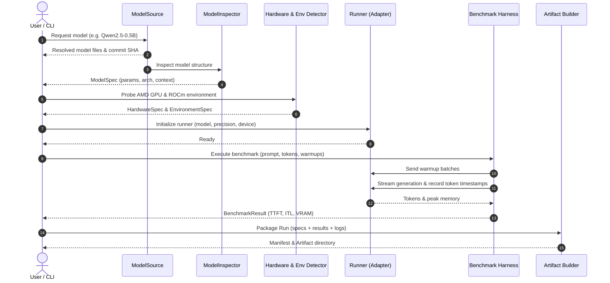

# ROCmHub Architecture Specification

> **Mission**: *"We make every open model AMD-ready automatically."*

ROCmHub is an open-source platform designed to automate the preparation, optimization, benchmarking, and verification of open AI models on AMD GPUs and the ROCm ecosystem.

---

## 1. Architectural Principles

1. **Modularity over Monolith**: Each stage of the pipeline (model acquisition, inspection, hardware detection, execution, benchmarking, and artifact generation) is encapsulated behind clear, typed interfaces.
2. **Deterministic Reproducibility**: No benchmark or run is valid without full provenance:
   - Model identifier, requested revision (branch/tag), and resolved immutable Git commit SHA.
   - Hardware spec: AMD GPU product name, compute units, VRAM, and exact `gfx` target string (e.g. `"gfx90a"`, `"gfx942"`, `"gfx1100"`, `"unknown"`).
   - Software environment: OS, Linux kernel, ROCm runtime, HIP version, driver version, PyTorch ROCm build, and active environment variables.
   - Execution config: backend runtime, precision, batch size, prompt/generation length, warmup iterations.
   - Raw logs, performance metrics (TTFT, ITL, throughput, peak VRAM), and explicit execution status.
3. **Separation of Benchmark Guard and Optimizer**: Benchmarking must remain isolated from any future optimization agent. The AI Engineer proposes candidates; a standalone, tamper-proof Benchmark Guard measures and certifies Pareto-optimal results. An agent never certifies its own output.
4. **Separation of Optimization and Validation**: Performance gains must be co-validated with output correctness (perplexity, numerical drift, or semantic evaluation). Fast but corrupted outputs are rejected.
5. **Runtime-Agnostic Core**: Core workflows do not hardcode vLLM, SGLang, or TGI. Runtimes are treated as interchangeable backend adapters implementing a unified execution contract.
6. **Hardware Heterogeneity & Open Target Discovery**: The architecture does not assume a single GPU type. It explicitly supports both datacenter (AMD Instinct / CDNA) and workstation/consumer (AMD Radeon / RDNA) architectures. Hardware detection probes real runtime capabilities dynamically; static compatibility matrices serve only as versioned advisory hints. An unknown GPU or gfx string is never rejected solely due to absence from a hardcoded list.
7. **Grounded Capabilities & Diagnostic Integrity**: If a feature depends on a specific ROCm version or gfx architecture, it is explicitly modeled as a capability constraint. Diagnostic mode on non-ROCm systems allows model inspection, environment discovery, schema validation, and pipeline verification, but NEVER generates synthetic or fake benchmark numbers. Metrics on non-inference runs are strictly marked `NOT_MEASURED` or `None`.

---

## 2. MVP Boundaries

### In Scope for MVP (Phase 1)
- **Local CLI Pipeline**: Single command to inspect, run, benchmark, and package a model.
- **Hugging Face Model Source**: Resolution of model references to an immutable commit SHA, downloading config and weights.
- **Static & Dynamic Model Inspector**: Extraction of architecture class, parameter count, context length, default precision, and tensor layout without unnecessary full-weight loads.
- **AMD/ROCm Environment Detector**:
  - Live detection via `rocm-smi`, `/sys/class/kfd`, `torch.version.hip`, and `rocminfo`.
  - Dynamic discovery of target architecture (`gfx_target` as an open string), VRAM, ROCm version, and PyTorch HIP status.
  - Safe Diagnostic / Fallback mode for development/CI on non-AMD environments without fake performance numbers.
- **Baseline Hugging Face / PyTorch Runner**: Direct execution adapter using native PyTorch on ROCm (FP16/BF16, single GPU).
- **Inference Benchmark Harness**:
  - Time To First Token (TTFT in milliseconds: `ttft_ms`).
  - Inter-Token Latency (ITL in milliseconds: `itl_ms_mean`, `itl_ms_p50`, `itl_ms_p90`, `itl_ms_p99`).
  - Generation throughput (`throughput_tokens_per_sec`).
  - Peak allocated and reserved VRAM (`peak_vram_used_mb`).
  - Storage for raw latency samples and metric summaries.
- **Reproducible Artifact Builder**: Self-contained output directory containing `manifest.json`, benchmark results, environment snapshot, and a reproduction command.

### Explicitly Out of Scope for MVP
- Cloud orchestration, multi-node clusters, and distributed job queues.
- Web UI, authentication, and user management.
- Custom inference engine development.
- Autonomous AI Engineer optimization loops.
- Kernel Arena (custom Triton/HIP kernel compilation).
- Quantization search (AWQ, GPTQ, FP8 sweeps).
- Automatic CUDA-to-HIP source translation.

---

## 3. Core Modules & Responsibilities

```
rocmhub/
├── models/        # Model fetching, caching, and structural inspection
├── hardware/      # AMD GPU discovery, gfx target detection, ROCm environment specs
├── runners/       # Pluggable backend adapters (Baseline HF/PyTorch, future vLLM, SGLang)
├── benchmarks/    # Isolated benchmarking harness, metric collectors (TTFT, ITL, VRAM)
├── artifacts/     # Manifest generation, schema validation, artifact packaging
└── cli/           # Developer command-line interface
```

### 3.1 `rocmhub.models`
- **`ModelSource` (Protocol)**: Abstract interface decoupling the core from specific model registries:
  - `source_name: str`: Identifier (e.g. `"huggingface"`).
  - `resolve_revision(model_id, revision) -> str`: Resolves requested revision (branch/tag/SHA) into an immutable 40-character Git commit SHA.
  - `get_repository_metadata(model_id, revision) -> RepositoryMetadata`: Obtains file listings and hub-level metadata without downloading tensor binaries.
  - `fetch_metadata_file(model_id, filename, revision) -> Optional[str]`: Fetches lightweight JSON/text configs.
- **`HuggingFaceModelSource`**: Adapter using `huggingface_hub`:
  - Enforces `trust_remote_code=False` at all times (no remote code execution).
  - Translates Hub-specific exceptions on the adapter boundary into domain exceptions (`ModelNotFoundError`, `AuthRequiredError`, `RevisionNotFoundError`, `NetworkError`).
  - Utilizes standard Hugging Face local cache (`~/.cache/huggingface/hub`).
- **`ModelInspector`**: Static analysis engine constructing validated `ModelSpec`:
  - Safely extracts `architecture` without loading weights into RAM/VRAM.
  - Detects `weights_format` (`safetensors`, `pytorch_bin`, `gguf`, `unknown`).
  - Discovers `parameter_count` from server-side safetensors metadata or index metadata without guessing (`None` if indeterminable).
  - Extracts `context_length` from standard config fields (`max_position_embeddings`, `seq_length`, etc.).
  - Rejects untrusted remote code with `RemoteCodeRequiredError` if architecture resolution requires executing repository scripts.

### 3.2 `rocmhub.hardware`
- **`HardwareDetector`**: Queries hardware capabilities dynamically:
  - GPU product name (e.g., `AMD Instinct MI300X`, `AMD Radeon RX 7900 XTX`, or `None` if non-GPU host).
  - Target architecture (`gfx_target: str`, open string discovered from `rocminfo` or sysfs).
  - Total and available VRAM.
  - Compute Unit (CU) count and bus information if available.
- **`EnvironmentDetector`**: Gathers system state:
  - OS version and Linux kernel release.
  - ROCm version (from `/opt/rocm/.info/version` or `rocm-smi`, or `None`).
  - HIP runtime version and `torch.version.hip` (or `None`).
  - Critical environment variables (`HSA_OVERRIDE_GFX_VERSION`, `HIP_VISIBLE_DEVICES`, `ROCR_VISIBLE_DEVICES`).
- **`ROCmCapabilities`**: Evaluates hardware constraints based on detected runtime capabilities. Advisory matrix is secondary and versioned; open strings allow new or unlisted hardware.

### 3.3 `rocmhub.runners`
- **`BaseRunner` (Protocol/ABC)**: Defines the common lifecycle:
  - `initialize(model_spec, runtime_config, hardware_spec)`
  - `warmup(sample_input)`
  - `generate(prompt, max_tokens, **kwargs) -> GenerationOutput`
  - `shutdown()`
- **`HuggingFaceRunner`**: MVP baseline implementation utilizing PyTorch HIP backend:
  - Loads model in requested precision (`fp16`, `bf16`, `fp32`).
  - Moves tensors to target AMD device (`cuda:0` under HIP).
  - Runs in `torch.inference_mode()`.

### 3.4 `rocmhub.benchmarks`
- **`BenchmarkHarness`**: Controls warm-up cycles and timed iterations.
- **`LatencyTracker`**: Custom streaming token collector recording:
  - Timestamp of prompt submission $t_0$.
  - First token arrival $t_1 \rightarrow \text{TTFT} = (t_1 - t_0) \times 1000$ ms.
  - Subsequent tokens $t_i \rightarrow \text{ITL}_i = (t_i - t_{i-1}) \times 1000$ ms.
  - Raw inter-token latency series for distribution analysis.
- **`MemoryTracker`**: Monitors device VRAM before run, during generation peak, and after run (using `torch.cuda.max_memory_allocated()` and ROCm SMI samples).

### 3.5 `rocmhub.artifacts`
- **`ArtifactBuilder`**: Bundles:
  - `manifest.json`: Machine-readable metadata conforming to `ArtifactManifest` schema.
  - `metrics.json`: Detailed benchmark statistics and optional raw samples.
  - `environment.json`: Complete snapshot of system, driver, and packages.
  - `run.log`: Console and stderr logs.
  - `reproduce.sh`: Executable bash script reproducing the exact run.

---

## 4. Minimal Data Models

```
                               ┌───────────────────┐
                               │   ExperimentSpec  │
                               └─────────┬─────────┘
                                         │
                 ┌───────────────────────┼───────────────────────┐
                 │                       │                       │
                 ▼                       ▼                       ▼
       ┌───────────────────┐   ┌───────────────────┐   ┌───────────────────┐
       │     ModelSpec     │   │    HardwareSpec   │   │  EnvironmentSpec  │
       └───────────────────┘   └───────────────────┘   └───────────────────┘
                 │                       │                       │
                 └───────────────────────┼───────────────────────┘
                                         │
                                         ▼
                               ┌───────────────────┐
                               │  BenchmarkResult  │
                               └─────────┬─────────┘
                                         │
                                         ▼
                               ┌───────────────────┐
                               │  ArtifactManifest │
                               └───────────────────┘
```

### 4.1 `ExecutionStatus`
```python
class ExecutionStatus(str, Enum):
    SUCCESS = "SUCCESS"              # Benchmark executed and measured valid metrics
    FAILED = "FAILED"                # Execution crashed or produced runtime error
    SKIPPED = "SKIPPED"              # Deliberately skipped (e.g., incompatible precision)
    NOT_MEASURED = "NOT_MEASURED"    # Diagnostic run or dry-run without active inference
```

### 4.2 `ModelSpec`
```python
class ModelSpec:
    schema_version: str = "1.0.0"
    model_id: str                   # e.g. "Qwen/Qwen2.5-0.5B-Instruct"
    source: str                     # e.g. "huggingface"
    requested_revision: str         # e.g. "main", "v1.0"
    commit_sha: str                 # Resolved immutable 40-char git commit SHA
    architecture: str | None        # e.g. "Qwen2ForCausalLM"
    parameter_count: int | None     # Total parameters count
    context_length: int | None      # Max context length
    default_dtype: str | None       # e.g. "bfloat16"
    weights_format: str | None      # "safetensors" or "pytorch_bin"
```

### 4.3 `HardwareSpec`
```python
class HardwareSpec:
    schema_version: str = "1.0.0"
    gpu_present: bool               # True if a GPU is detected, False on CPU/dev host
    gpu_vendor: str | None          # "AMD" or other vendor, None if no GPU
    device_id: int | None           # e.g. 0
    device_name: str | None         # e.g. "AMD Radeon RX 7900 XTX"
    family: str | None              # "Radeon", "Instinct", or None
    gfx_target: str | None          # Open string, e.g. "gfx1100", "gfx942", "unknown"
    vram_total_mb: int | None       # Total VRAM in MB
    compute_units: int | None       # Number of CUs if reported
```

### 4.4 `EnvironmentSpec`
```python
class EnvironmentSpec:
    schema_version: str = "1.0.0"
    os: str                         # e.g. "Linux 6.8.0-40-generic"
    python_version: str             # e.g. "3.11.9"
    rocm_version: str | None        # e.g. "6.2.0" or None if ROCm not installed
    hip_version: str | None         # e.g. "6.2.41133" or None
    torch_version: str              # e.g. "2.4.0+rocm6.2" or "2.4.0"
    torch_hip_available: bool       # torch.cuda.is_available() with ROCm build
    env_vars: dict[str, str]        # Tracked flags: HSA_OVERRIDE_GFX_VERSION, etc.
```

### 4.5 `ExperimentSpec`
```python
class ExperimentSpec:
    schema_version: str = "1.0.0"
    experiment_id: str              # Unique experiment UUID
    model: ModelSpec
    hardware: HardwareSpec
    environment: EnvironmentSpec
    runtime_name: str               # e.g. "hf-transformers"
    precision: str                  # e.g. "fp16", "bf16", "fp32"
    benchmark_params: dict          # prompt_tokens, max_new_tokens, warmup_runs, iterations
    created_at_utc: str             # ISO-8601 UTC timestamp
```

### 4.6 `BenchmarkResult`
```python
class BenchmarkResult:
    schema_version: str = "1.0.0"
    status: ExecutionStatus         # SUCCESS | FAILED | SKIPPED | NOT_MEASURED
    error_message: str | None = None
    ttft_ms: float | None = None               # Time To First Token in ms (None if not measured)
    itl_ms_mean: float | None = None           # Mean Inter-Token Latency in ms
    itl_ms_p50: float | None = None            # 50th percentile ITL
    itl_ms_p90: float | None = None            # 90th percentile ITL
    itl_ms_p99: float | None = None            # 99th percentile ITL
    throughput_tokens_per_sec: float | None = None
    peak_vram_used_mb: float | None = None
    total_latency_ms: float | None = None
    generated_tokens_count: int | None = None
    raw_latencies_ms: list[float] | None = None # Raw per-token latencies for future analysis
```

### 4.7 `ArtifactManifest`
```python
class ArtifactManifest:
    schema_version: str = "1.0.0"
    manifest_id: str                # e.g. "rocmhub-art-20260921-001"
    created_at_utc: str             # ISO-8601 UTC timestamp
    experiment: ExperimentSpec
    result: BenchmarkResult
    reproduce_command: str          # e.g. "rocmhub run --model ... --precision ..."
    manifest_checksum: str          # SHA256 of canonical JSON content
```

---

## 5. Component Pipeline & Sequence



---

## 6. AMD ROCm Capabilities & Constraints Matrix (Advisory)

> **Note**: This matrix serves solely as a versioned advisory reference. Hardware detection probes the live platform (`rocminfo`, `sysfs`, `torch.version.hip`) dynamically. New or unlisted `gfx_target` identifiers are stored as open strings and are never rejected simply because they are absent from this table.

| Architecture | GFX Target | Product Line | Typical Status | Key Capabilities / Flags |
|---|---|---|---|---|
| **CDNA3** | `gfx942` | Instinct MI300A / MI300X | Fully Supported | FP8, BF16, FlashAttention, unified memory |
| **CDNA2** | `gfx90a` | Instinct MI210 / MI250 / MI250X | Fully Supported | Full FP64/BF16, FlashAttention-2 |
| **CDNA1** | `gfx908` | Instinct MI100 | Supported | Matrix cores, BF16 |
| **RDNA3** | `gfx1100` | Radeon RX 7900 XTX / XT / GRE | Community / Workstation | Requires `HSA_OVERRIDE_GFX_VERSION=11.0.0` in some ROCm releases, BF16, WMMA |
| **RDNA3** | `gfx1101` / `gfx1102` | Radeon RX 7800 / 7700 / 7600 | Community | Often requires override; limited VRAM |
| **RDNA2** | `gfx1030` | Radeon RX 6800 / 6900 | Community | No native BF16 matrix cores (software/cast) |
| **Non-AMD / Dev** | `None` / open | macOS / Linux non-GPU | Diagnostic Only | Used for dry-run inspection, testing, schema validation. Metrics marked `NOT_MEASURED`. |

---

## 7. Proposed Repository Structure

```
RocmHub/
├── ARCHITECTURE.md                 # System architecture (this document)
├── DEVELOPMENT_PLAN.md             # Phased development roadmap
├── pyproject.toml                  # Packaging and dependencies
├── README.md                       # Project introduction & quickstart
├── src/
│   └── rocmhub/
│       ├── __init__.py
│       ├── __main__.py             # Entrypoint for python -m rocmhub
│       ├── cli/
│       │   ├── __init__.py
│       │   └── main.py             # CLI commands: run, inspect, env
│       ├── core/
│       │   ├── __init__.py
│       │   ├── errors.py           # Domain exceptions
│       │   └── types.py            # Common data classes & enums
│       ├── models/
│       │   ├── __init__.py
│       │   ├── source.py           # HF Hub fetcher & local resolver
│       │   └── inspector.py        # Static model config & weight inspector
│       ├── hardware/
│       │   ├── __init__.py
│       │   ├── detector.py         # ROCm & AMD GPU discovery
│       │   ├── environment.py      # System, kernel, and driver spec
│       │   └── mock.py             # Diagnostic detector for non-AMD machines
│       ├── runners/
│       │   ├── __init__.py
│       │   ├── base.py             # Runner protocol & lifecycle contract
│       │   └── hf_runner.py        # Native PyTorch/Transformers baseline runner
│       ├── benchmarks/
│       │   ├── __init__.py
│       │   ├── harness.py          # Benchmark runner & timing orchestration
│       │   ├── metrics.py          # TTFT, ITL, throughput calculation
│       │   └── memory.py           # VRAM allocation monitor
│       └── artifacts/
│           ├── __init__.py
│           ├── builder.py          # Artifact packaging & manifest generator
│           └── schema.py           # Manifest serialization & validation
└── tests/
    ├── unit/
    │   ├── test_models.py
    │   ├── test_hardware.py
    │   ├── test_benchmarks.py
    │   └── test_artifacts.py
    └── integration/
        └── test_pipeline_dryrun.py # End-to-end mock execution test
```

---

## 8. Future Extension Points

1. **AI Engineer Optimization Agent**: Plugs in after `baseline execution`. Proposes candidate configs (quantization, runtime backends, kernel configurations) and sends them to the runner.
2. **Benchmark Guard**: An independent arbiter that re-benchmarks agent-proposed candidates in a sealed, unmanipulated harness to ensure true Pareto improvements.
3. **Alternative Runtimes**:
   - `VLLMRunner`: High-throughput PagedAttention / vLLM ROCm runner.
   - `SGLangRunner`: Fast RadixAttention runner.
   - `LlamaCppHipRunner`: Minimal C++ GGUF inference via hipBLAS.
4. **Quantization Search**: AWQ, GPTQ, and FP8 calibration matrix search tailored to AMD matrix cores.
5. **Kernel Arena**: Automated JIT compilation and benchmarking of custom AMD Triton and Composable Kernel (CK) attention kernels.
6. **ROCmHub Registry**: Remote artifact publishing and model hub integration.
